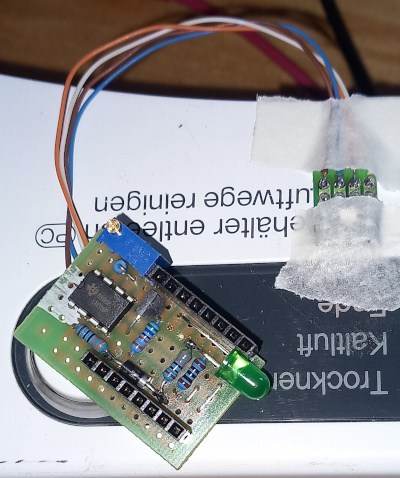
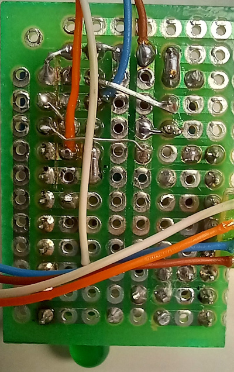
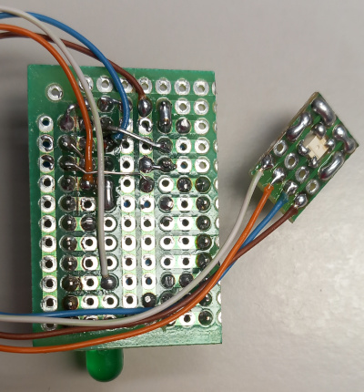
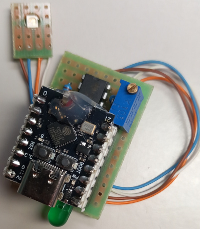
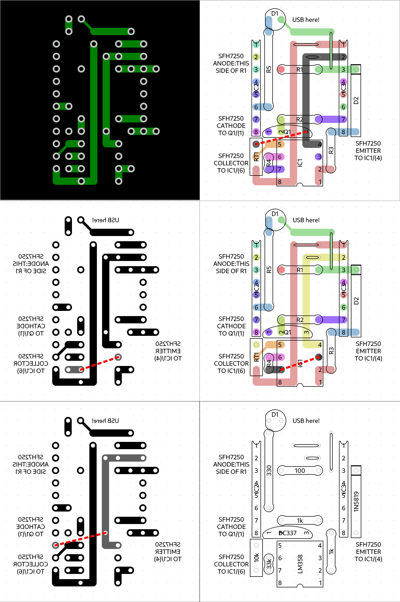
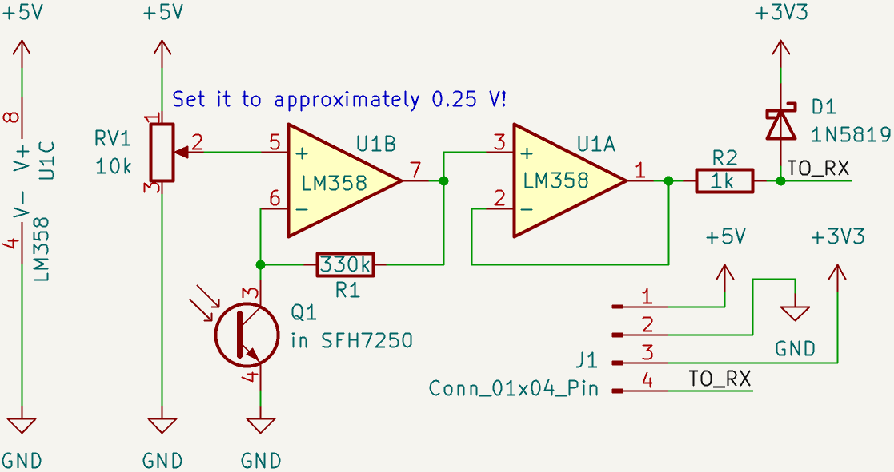

# Transmitter design with LM358

[VEROBOARD DESIGN](lm358.vrt)

   

In the schematic, R1 should be changed to 33k. 330k makes the ambient light sensitivity too high. The design above use different part names ( R1 <-> R4, R2 <-> R3, RV1 <-> RT1 )

